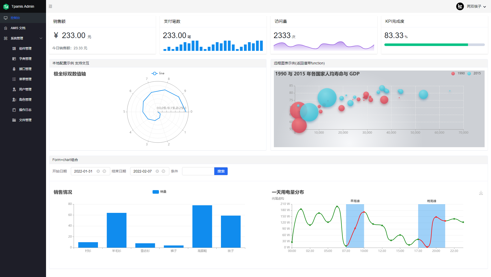
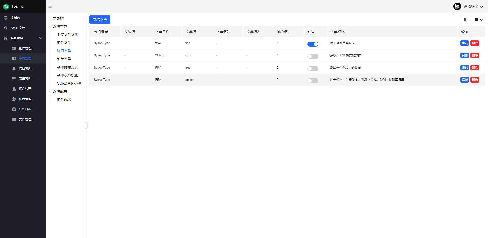
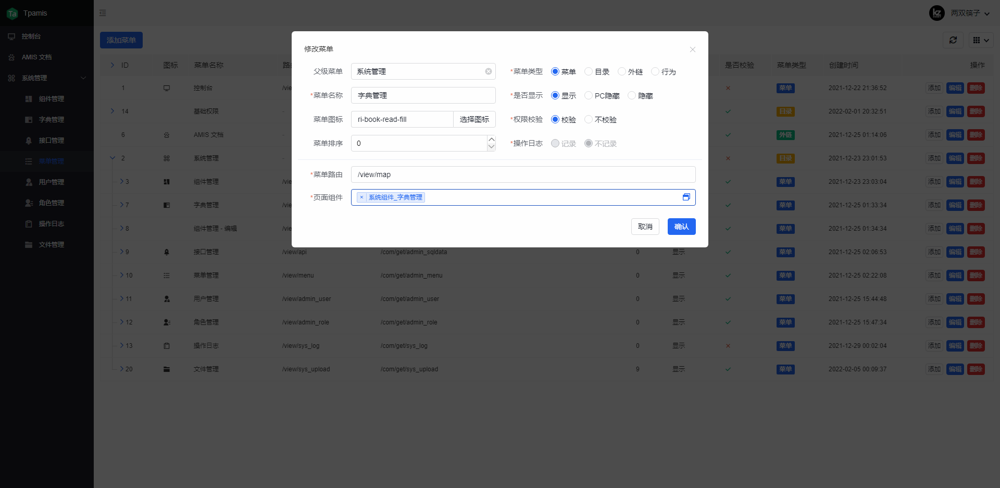
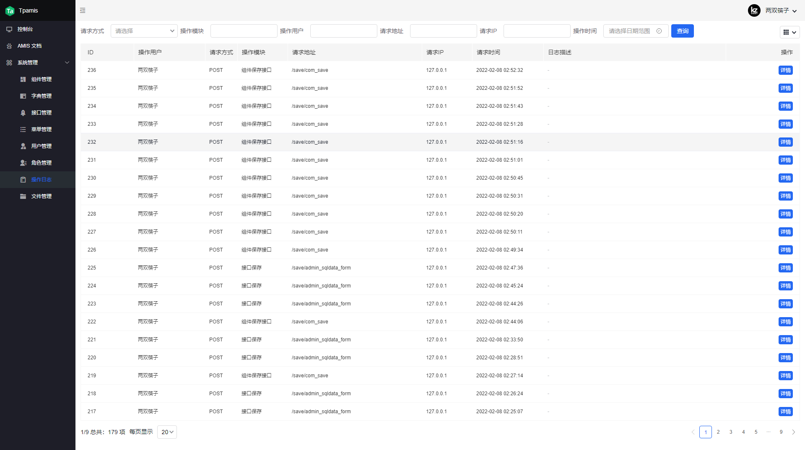
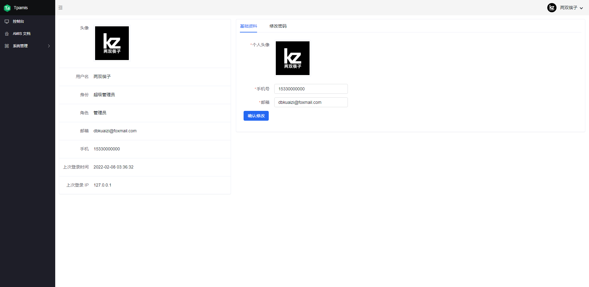

  <h1 align="center">
    
  </h1>
  <h4 align="center">
    基于 ThinkPHP6.0 与 amis 构建的低代码开发框架
  </h4> 

 
 
 
 
 

该项目可以通过纯 JSON 快速配置后台管理系统，无需前端参与，后端开发人员即可完成。
严格来说依然属于 MVC 架构，并非前后端分离。

## 特点
- 无需专业前端，纯 JSON 构建页面，支持 amis 120+ 的前端组件
- 移动端兼容，amis 提供了良好的移动端设备兼容，无需额外开发移动端页面。
- 常用后台功能，提供了完整的后台基础功能，开箱即用
- Echarts 图表，支持 Echarts 所有功能

## 功能
- [x] 组件管理，组件 JSON 管理，支持嵌套使用
- [x] 字典管理，枚举映射、动态配置
- [x] 接口管理，使用SQL可直接查询列表、单条、树形、option 四种数据结构
- [x] 通用CURD, 使用通用接口快速对数据进行简单的增删改查操作 (仅支持单表，多表或复杂操作仍需要编写接口代码)
- [x] 通用排序, 通用排序接口开发
- [x] 扩展模板，扩展 Tpamis 特有的模板标签，这些标签可以帮我们更好的构建页面 JSON
- [x] 用户管理，后端的用户管理功能
- [x] 个人中心，后端用户可以自行重置密码及基础信息修改
- [x] 角色管理，用户权限控制
- [x] 菜单管理，对后台菜单进行配置
- [x] 主题切换，通过修改配置文件，即可使用 amis 提供的主题样式
- [x] 日志管理，后台用户的登录日志和操作日志
- [x] 附件管理，通用的附件上传接口，以及附件管理功能

## 文档（完善中）
https://gitee.com/dbkuaizi/tpamis/wikis

## 截图

## 版权
Tpamis 使用了与 ThinkPHP 和 amis 一致的的版权协议 Apache2。
本项目可以免费商用但必须在代码中标注。